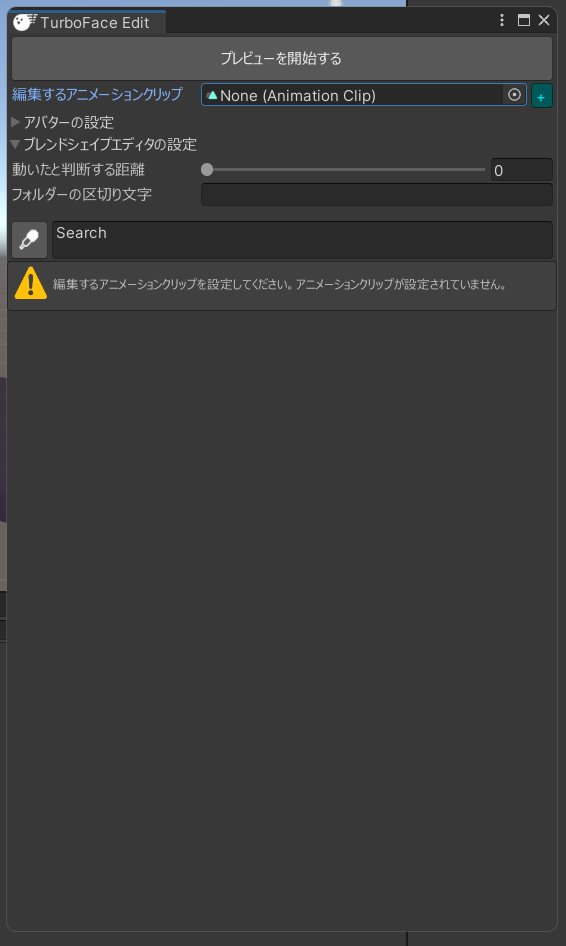
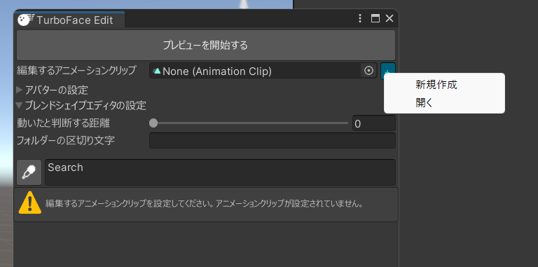
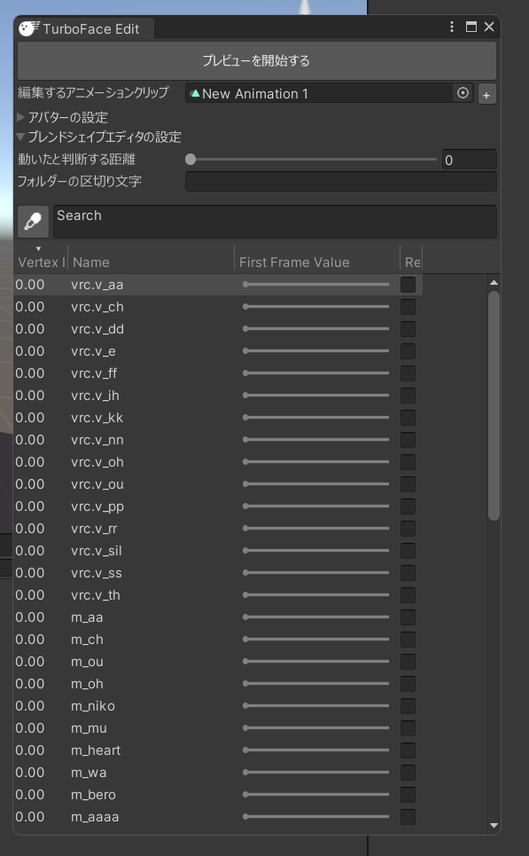
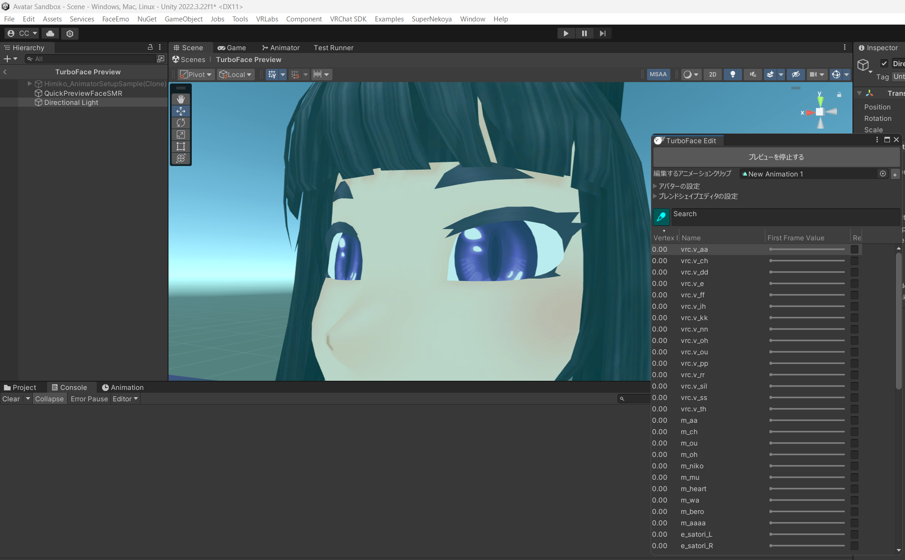
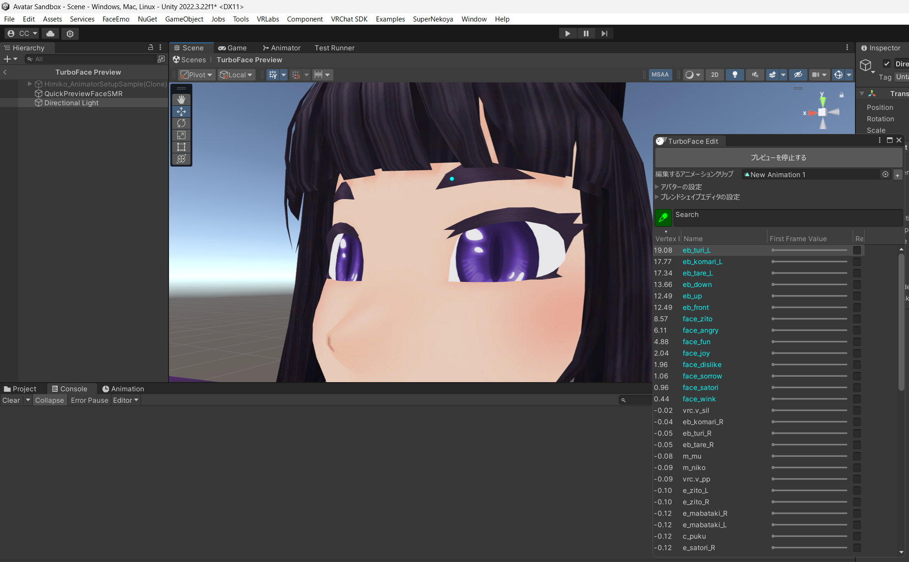
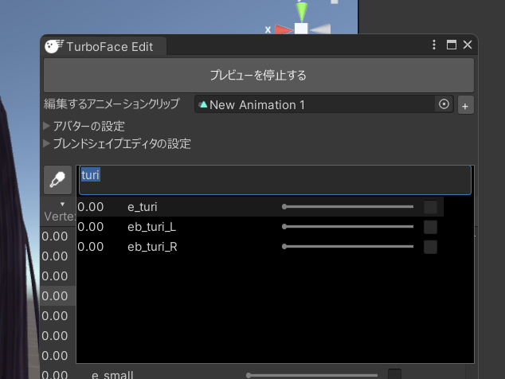
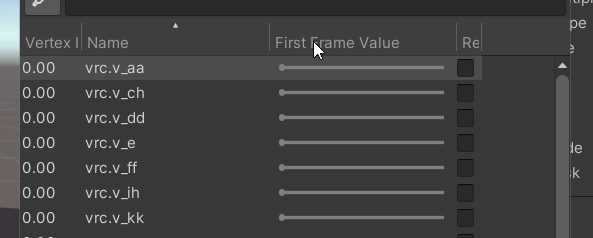
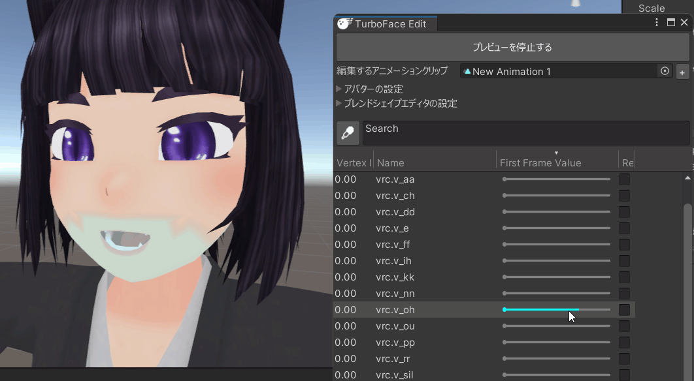
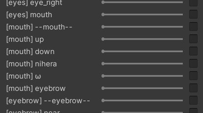

# TurboFace Editの基本的な使い方
TurboFace Editは、非常に強力な表情アニメーション作成ツールです。このツールを使うことにより、高速に表情アニメーションを作成することができます。

## 起動
TurboFace Editは、二つの方法で起動することができます。
1. アバターのオブジェクトを右クリックして TurboFace > TurboFace Editを選択する
2. TurboFace Setupから起動する

起動すると、このような画面が表示されます。

## 編集するアニメーションクリップを作成/選択する

「編集するアニメーションクリップ」の横にある+ボタンを押すことで編集するアニメーションクリップを指定することができます。

## 機能の説明
アニメーションクリップを指定すると、以下のような画面になります。

### 「プレビューを開始する」
「プレビューを開始する」ボタンを押すと、編集中のアニメーションクリップをプレビューすることができます。**以降の説明はプレビュー中の画面を前提にしています**。

### ブレンドシェイプピッカー
TurboFace Editの最も強力な機能、「ブレンドシェイプピッカー」を起動します。
ブレンドシェイプピッカーは、動かしたいメッシュを選択してブレンドシェイプを探すことができる機能です。

をクリックすると、
シーンビューが選択待ち状態になります。

この状態で、動かしたいメッシュの頂点(たとえば、眉)をクリックすると、その頂点を動かすブレンドシェイプがハイライトされます。

このとき、並び順は「専ら選択した頂点を動かしているブレンドシェイプ」が先、「その頂点も動かすが、ほかの頂点も動かしているブレンドシェイプ」が後になります。

### 検索ウィンドウ
ブレンドシェイプピッカーの右にある検索ボックスをクリックすると、ブレンドシェイプの名前から検索を行うことができます。

### ブレンドシェイプテーブル
ブレンドシェイプテーブルのヘッダーをクリックすると、ブレンドシェイプの並び順をその値の順番にすることができます。

### スライダー
スライダーをマウスホバーするとその位置の値でプレビューされます。クリックするとその値でアニメーションの値が確定します。

### 登録チェックボックス
スライダーの横にあるチェックボックスは、そのブレンドシェイプがアニメーションに登録されていることを示します。
チェックボックスをクリックすると、ブレンドシェイプの登録を解除することができます。

### フォルダー表示
フォルダ分けされているブレンドシェイプは自動でフォルダ表示が付きます。

フォルダーの区切り文字は「ブレンドシェイプエディタの設定」→「フォルダの区切り文字」で変更可能です。
