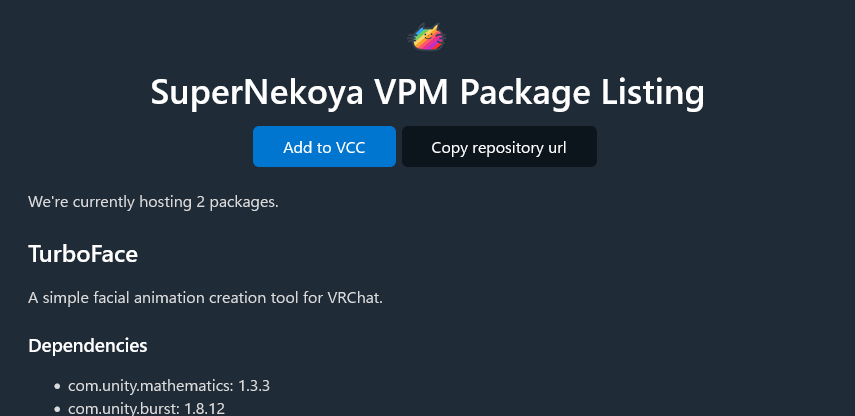
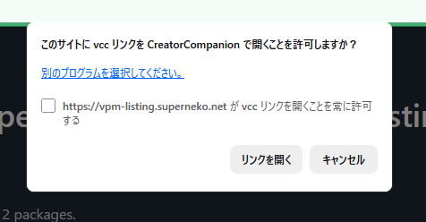
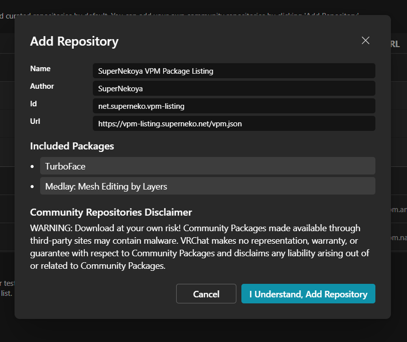
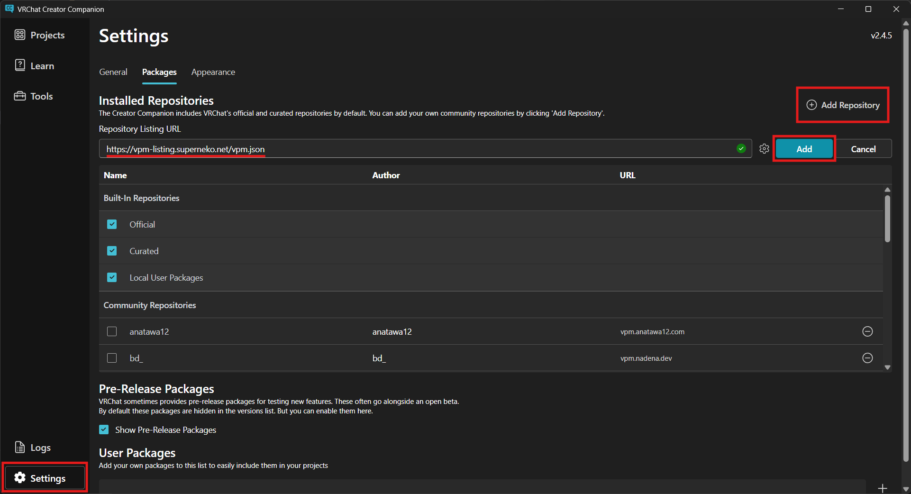
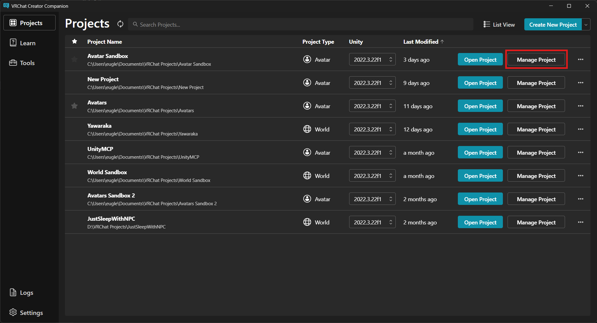
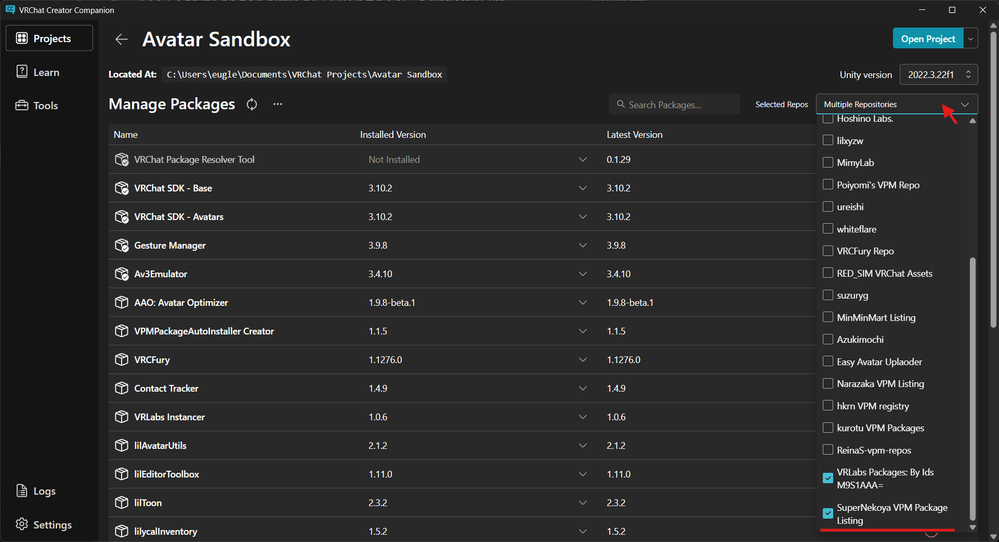
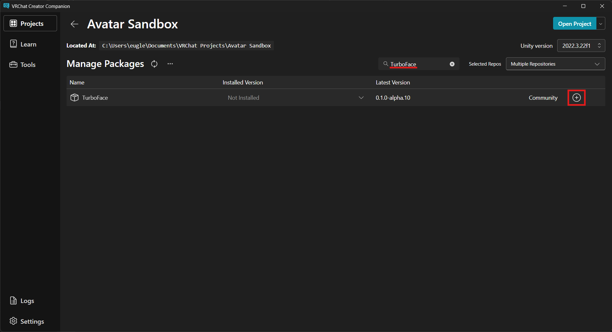
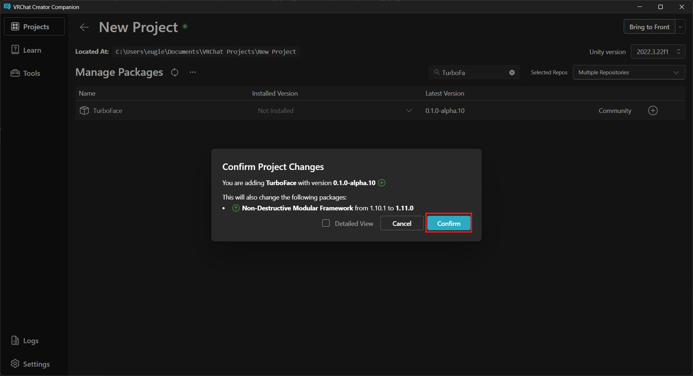

# TurboFaceのインストール
TurboFaceは、VCCからインストール可能です。

## VCCにSuperNekoya VPM Package Listing を追加する
[SuperNekoya VPM Package Listing](https://vpm-listing.superneko.net/) を開きAdd to VCCをクリックしてください。

VCCリンクを開くかどうかを確認するダイアログが開いた場合、リンクを開くことを許可してください。

リポジトリを追加するかどうかを確認するダイアログが出るので、「I Understand, Add Repository」をクリックしてください。

### うまくいかなかった場合
[SuperNekoya VPM Package Listing](https://vpm-listing.superneko.net/) の「Copy repository url」をクリックしてください。`https://vpm-listing.superneko.net/vpm.json`がコピーされます。

これでリポジトリのURLがコピーされたので、VCCを開き、「Settings」→「Add Repository」で出てくるテキストボックスにペーストし、「Add」をクリックしてください。

リポジトリを追加するかどうかを確認するダイアログが出るので、「I Understand, Add Repository」をクリックしてください。

## TurboFaceをプロジェクトに導入する

TurboFaceを導入したいプロジェクトの「Manage Project」をクリックしてください。

Selected ReposのSuperNekoya VPM Package Listingにチェックが入っていることを確認してください。入ってなければチェックを入れてください。

検索欄に「TurboFace」と打ち込んで、TurboFaceの追加ボタンをクリックしてください。

インストールを許可するダイアログが出てくるので、「Confirm」をクリックしてください。

以上でインストールが完了です。お疲れさまでした。